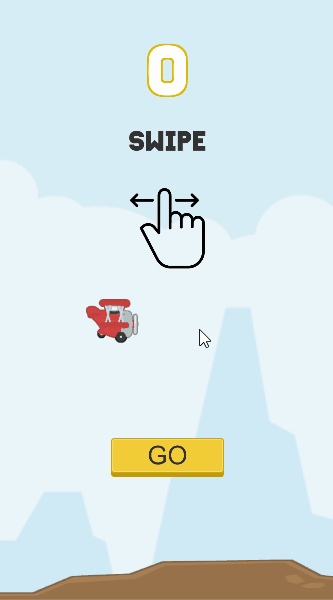

# [Unity] Tappy-Plane
## Game originaly created in 2018-01.
Simple "Flappy Bird" clone with different "flap" mechanic. Instead of flaping when tapping on screen, plane flies up when you click and hold the screen.
I've initialy created the game just because at the time I wanted to train my Unity skills and make a playable game.
Thus, the game does not have any sound, since I did not spend any time for searching for sound tracks or effects.
Assets used from [Kenney] (https://kenney.nl/assets/tappy-plane)
Built apk for android [download] (https://www.dropbox.com/s/kj7yg316lv1aofc/TappyPlane.apk?dl=0)

